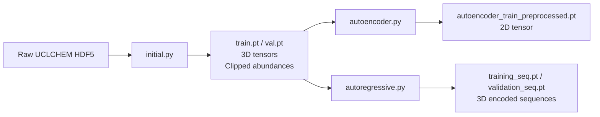

# Data Intake Updates for 3D Tensor Format

## Overview

The [`initial.py`](../src/preprocessors/initial.py) preprocessor now saves data as 3D PyTorch tensors with shape `(N_tracers, N_timesteps, N_features)` where `N_features = N_phys + N_species`. Species abundances are clipped to [1e-20, 1.0] range during initial preprocessing.

## Naming Changes

- `abundances_only` → `autoencoder`
- `markovianautoregressive` → `autoregressive`

## Data Flow Pipeline



## Initial Preprocessor Updates

**File:** [`src/preprocessors/initial.py`](../src/preprocessors/initial.py)

**Additional preprocessing step needed:**

The `_clip_abundances()` method already clips abundances, but we need to ensure it uses minmax scaling to [1e-20, 1.0]:

**Current implementation at line 146:**
```python
def _clip_abundances(self, df: pd.DataFrame, species: list[str]) -> pd.DataFrame:
    """Clips species abundances to configured range."""
    df = df.sort_values(by=["Model", "Time"]).reset_index(drop=True)
    df[species] = df[species].clip(
        lower=self.cfg.abundances_clipping.lower,
        upper=self.cfg.abundances_clipping.upper,
    )
    return df
```

This already implements the clipping to [1e-20, 1.0] via config.

**Output Format:**
- `train.pt` - Shape: `(N_train_tracers, N_timesteps, N_features)`
- `val.pt` - Shape: `(N_val_tracers, N_timesteps, N_features)`
- `N_features = N_phys + N_species` (e.g., 4 + 333 = 337)

## Shared Data Loading Function

**File:** [`src/data_processing.py`](../src/data_processing.py)

**Add as module-level function (after imports):**

```python
def load_3d_tensors(cfg: DictConfig) -> tuple[torch.Tensor, torch.Tensor]:
    """Load 3D tensor datasets from initial preprocessing.

    Args:
        cfg: Dataset configuration containing input_dir

    Returns:
        Tuple of (training_tensor, validation_tensor) with shape (N_tracers, N_timesteps, N_features)
    """
    from pathlib import Path

    input_dir = Path(cfg.input_dir)
    train_path = input_dir / "train.pt"
    val_path = input_dir / "val.pt"

    if not train_path.exists() or not val_path.exists():
        raise FileNotFoundError(
            f"Preprocessed data not found. Expected files:\n"
            f"  - {train_path}\n"
            f"  - {val_path}\n"
            f"Run initial preprocessing first: python preprocess.py preprocessing=initial"
        )

    training = torch.load(train_path)
    validation = torch.load(val_path)

    print(f"Loaded training tensor: {training.shape}")
    print(f"Loaded validation tensor: {validation.shape}")

    return training, validation
```

## Autoencoder Preprocessor

**File:** `src/preprocessors/autoencoder.py` (renamed from `abundances_only.py`)

### Required Changes

#### 1. Update Import

Add to imports section:
```python
from ..data_processing import load_3d_tensors, Processing
```

#### 2. Update Class Name and Docstring

```python
class AutoencoderPreprocessor:
    """Preprocessor for autoencoder training data (abundances only)."""
```

#### 3. Rewrite `run()` Method

**Replace entire method:**

```python
def run(self, output_dir: Path):
    """Load, scale, and save preprocessed autoencoder training data."""
    print("=" * 80)
    print("Preprocessing Autoencoder Data")
    print("=" * 80)

    # Load 3D tensors from initial preprocessing
    print("\nLoading datasets...")
    training_tensor, validation_tensor = load_3d_tensors(self.cfg.data)

    # Convert to numpy for processing
    training_np = training_tensor.numpy()
    validation_np = validation_tensor.numpy()

    # Get dimensions from dataset config
    num_phys = self.cfg.data.num_phys

    # Reshape to 2D: (N_tracers * N_timesteps, N_features)
    train_shape = training_np.shape
    val_shape = validation_np.shape

    training_flat = training_np.reshape(-1, train_shape[-1])
    validation_flat = validation_np.reshape(-1, val_shape[-1])

    # Scale abundances (in-place modification on species columns only)
    print("Scaling abundances...")
    processing = Processing(self.cfg.data, "cpu")
    processing.abundances_scaling(training_flat[:, num_phys:])
    processing.abundances_scaling(validation_flat[:, num_phys:])

    # Extract species only (autoencoder trains on abundances)
    training_species = training_flat[:, num_phys:]
    validation_species = validation_flat[:, num_phys:]

    # Convert to tensors
    training_tensor = torch.from_numpy(training_species).float()
    validation_tensor = torch.from_numpy(validation_species).float()

    # Save to disk
    train_path = output_dir / "autoencoder_train_preprocessed.pt"
    val_path = output_dir / "autoencoder_val_preprocessed.pt"

    print(f"\nSaving preprocessed data:")
    print(f"  Train: {train_path} - Shape: {training_tensor.shape}")
    print(f"  Val: {val_path} - Shape: {validation_tensor.shape}")

    torch.save(training_tensor, train_path)
    torch.save(validation_tensor, val_path)

    print("\nPreprocessing complete!")
    del training_np, validation_np, training_tensor, validation_tensor
    gc.collect()
```

### Configuration

**File:** `configs/preprocessing/autoencoder.yaml` (renamed from `abundances_only.yaml`)

```yaml
name: autoencoder
description: "Preprocess abundances for autoencoder training: load, scale, and save as PyTorch tensors"

# Dataset config via composition
defaults:
  - /data: grav
```

## Autoregressive Preprocessor

**File:** `src/preprocessors/autoregressive.py` (renamed from `markovianautoregressive.py`)

### Required Changes

#### 1. Remove `generate_sequence_indices()` Function

**Delete lines 17-41 entirely** - we're not calculating indices anymore.

#### 2. Rewrite `preprocess_sequences()` for 3D Tensors

**Replace entire function:**

```python
def preprocess_sequences(
    dataset_cfg: DictConfig,
    dataset_3d: torch.Tensor,
    processing_functions: Processing,
    inference_functions: Inference,
) -> torch.Tensor:
    """Preprocess 3D dataset: scale parameters and encode abundances with autoencoder.

    Args:
        dataset_3d: Shape (N_tracers, N_timesteps, N_features) where N_features = N_phys + N_species

    Returns:
        Encoded dataset with shape (N_tracers, N_timesteps, N_phys + N_latents)
    """
    num_phys = dataset_cfg.num_phys

    # Convert to numpy for scaling
    dataset_np = dataset_3d.numpy()
    n_tracers, n_timesteps, n_features = dataset_np.shape

    # Reshape to 2D for scaling: (N_tracers * N_timesteps, N_features)
    dataset_flat = dataset_np.reshape(-1, n_features)

    # Scale physical parameters and abundances in-place
    print("Scaling physical parameters...")
    processing_functions.physical_parameter_scaling(dataset_flat[:, :num_phys])

    print("Scaling abundances...")
    processing_functions.abundances_scaling(dataset_flat[:, num_phys:])

    # Encode abundances to latent space
    print("Encoding to latent space...")
    abundances_tensor = torch.from_numpy(dataset_flat[:, num_phys:]).float()
    latent_components = inference_functions.encode(abundances_tensor)
    latent_components = processing_functions.latent_components_scaling(latent_components).cpu().numpy()

    # Combine physical parameters with latents
    encoded_flat = np.hstack([dataset_flat[:, :num_phys], latent_components]).astype(np.float32)

    # Reshape back to 3D: (N_tracers, N_timesteps, N_phys + N_latents)
    encoded_3d = encoded_flat.reshape(n_tracers, n_timesteps, -1)

    print(f"Encoded shape: {encoded_3d.shape}")

    gc.collect()
    torch.cuda.empty_cache()

    return torch.from_numpy(encoded_3d).float()
```

#### 3. Update Class and `run()` Method

**Rename class and rewrite method:**

```python
class AutoregressivePreprocessor:
    """Preprocessor for emulator training data with 3D tensor support."""

    def __init__(self, cfg: DictConfig):
        """Initialize the preprocessor."""
        self.cfg = cfg

    def run(self, output_dir: Path):
        """Load autoencoder, preprocess emulator sequences, and save 3D tensors."""
        print("=" * 80)
        print("Preprocessing Emulator Sequences")
        print("=" * 80)

        # Load pretrained autoencoder for inference
        print("\nLoading pretrained autoencoder...")
        pretrained_path = Path(self.cfg.pretrained_model_path)
        if not pretrained_path.exists():
            raise FileNotFoundError(
                f"Pretrained autoencoder not found at {pretrained_path}. "
                "Please train the autoencoder first."
            )

        processing_functions = Processing(self.cfg.data, "cpu", self.cfg.autoencoder)
        autoencoder = load_autoencoder(Autoencoder, self.cfg.data, self.cfg.autoencoder, inference=True)
        inference_functions = Inference(self.cfg.data, processing_functions, autoencoder)

        # Load 3D datasets
        print("\nLoading 3D datasets...")
        training_3d, validation_3d = load_3d_tensors(self.cfg.data)

        print("\nPreprocessing training sequences...")
        training_encoded = preprocess_sequences(
            self.cfg.data,
            training_3d,
            processing_functions,
            inference_functions,
        )

        print("\nPreprocessing validation sequences...")
        validation_encoded = preprocess_sequences(
            self.cfg.data,
            validation_3d,
            processing_functions,
            inference_functions,
        )

        # Save to PyTorch tensors
        print("\nSaving preprocessed sequences:")
        print(f"  Training shape: {training_encoded.shape}")
        print(f"  Validation shape: {validation_encoded.shape}")

        torch.save(training_encoded, output_dir / "training_seq.pt")
        torch.save(validation_encoded, output_dir / "validation_seq.pt")

        print("\nPreprocessing complete!")
        del training_3d, validation_3d, training_encoded, validation_encoded
        gc.collect()
```

#### 4. Update Imports

Add to imports:
```python
from ..data_processing import load_3d_tensors, Processing
```

Remove unused:
```python
from numba import njit  # No longer needed
```

### Configuration

**File:** `configs/preprocessing/autoregressive.yaml` (renamed from `markovianautoregressive.yaml`)

```yaml
name: autoregressive
description: "Time-series aware preprocessing for autoregressive emulator with 3D tensor support"

# Pretrained autoencoder for encoding
pretrained_model_path: ${paths.weights_dir}/autoencoder.pth

# Dataset and model configs via composition
defaults:
  - /data: grav
  - /components/autoencoder: autoencoder_grav
```

## Configuration Updates

### Main Config

**File:** [`configs/config.yaml`](../configs/config.yaml)

**Update paths section:**
```yaml
defaults:
  - /data: grav
  - /preprocessing: initial  # Can override via CLI

# Paths
paths:
  data_dir: ${oc.env:DATA_DIR,./data}
  weights_dir: ${oc.env:WEIGHTS_DIR,./weights}
  preprocessed_dir: ${paths.data_dir}/preprocessed
  initial_output: ${paths.preprocessed_dir}/initial
  autoencoder_output: ${paths.preprocessed_dir}/autoencoder
  sequences_output: ${paths.preprocessed_dir}/autoregressive
```

### Data Config

**File:** [`configs/data/grav.yaml`](../configs/data/grav.yaml)

**Add dimension fields:**
```yaml
# Physical parameters
phys:
  - Density
  - gasTemp
  - Radfield
  - Av

num_phys: 4
num_species: 333

# Input directory for preprocessing steps after initial
input_dir: ${paths.initial_output}
```

## Summary of Changes

| File | Change Type | Description |
|------|-------------|-------------|
| **Renames** | | |
| `abundances_only.py` → `autoencoder.py` | **Rename** | Clearer naming - preprocesses for autoencoder |
| `markovianautoregressive.py` → `autoregressive.py` | **Rename** | Shorter naming convention |
| `abundances_only.yaml` → `autoencoder.yaml` | **Rename** | Match preprocessor name |
| `markovianautoregressive.yaml` → `autoregressive.yaml` | **Rename** | Match preprocessor name |
| `AbundancesOnlyPreprocessor` → `AutoencoderPreprocessor` | **Rename** | Class name update |
| `MarkovianautoregressivePreprocessor` → `AutoregressivePreprocessor` | **Rename** | Class name update |
| **New Functions** | | |
| [`data_processing.py`](../src/data_processing.py) | **Add function** | `load_3d_tensors()` - shared loader |
| **Modified Files** | | |
| [`autoencoder.py`](../src/preprocessors/abundances_only.py) | **Refactor** | Use shared loader, reference dataset config via `self.cfg.data` |
| [`autoregressive.py`](../src/preprocessors/markovianautoregressive.py) | **Delete** | Remove `generate_sequence_indices()` function |
| [`autoregressive.py`](../src/preprocessors/markovianautoregressive.py:44-84) | **Rewrite** | `preprocess_sequences()` for 3D input/output, no index generation |
| [`autoregressive.py`](../src/preprocessors/markovianautoregressive.py:94-142) | **Rewrite** | `run()` method to work with 3D tensors |
| [`autoencoder.yaml`](../configs/preprocessing/abundances_only.yaml) | **Update** | Use dataset config defaults via composition |
| [`autoregressive.yaml`](../configs/preprocessing/markovianautoregressive.yaml) | **Update** | Use dataset/model config defaults via composition |
| [`grav.yaml`](../configs/data/grav.yaml) | **Add fields** | `num_phys`, `num_species`, `input_dir` |
| [`config.yaml`](../configs/config.yaml) | **Update** | Add paths for all preprocessing outputs |

## Key Design Decisions

1. **Shared loader in `data_processing.py`**: Keeps loading logic centralized and reusable
2. **Config composition**: Preprocessors access dataset config via `self.cfg.data` instead of duplicating fields
3. **No sequence indexing**: Removed index generation - will handle sequencing differently later
4. **3D tensor preservation**: Autoregressive preprocessor maintains 3D structure throughout
5. **Clipping in initial step**: Abundances clipped to [1e-20, 1.0] happens once in initial preprocessing
