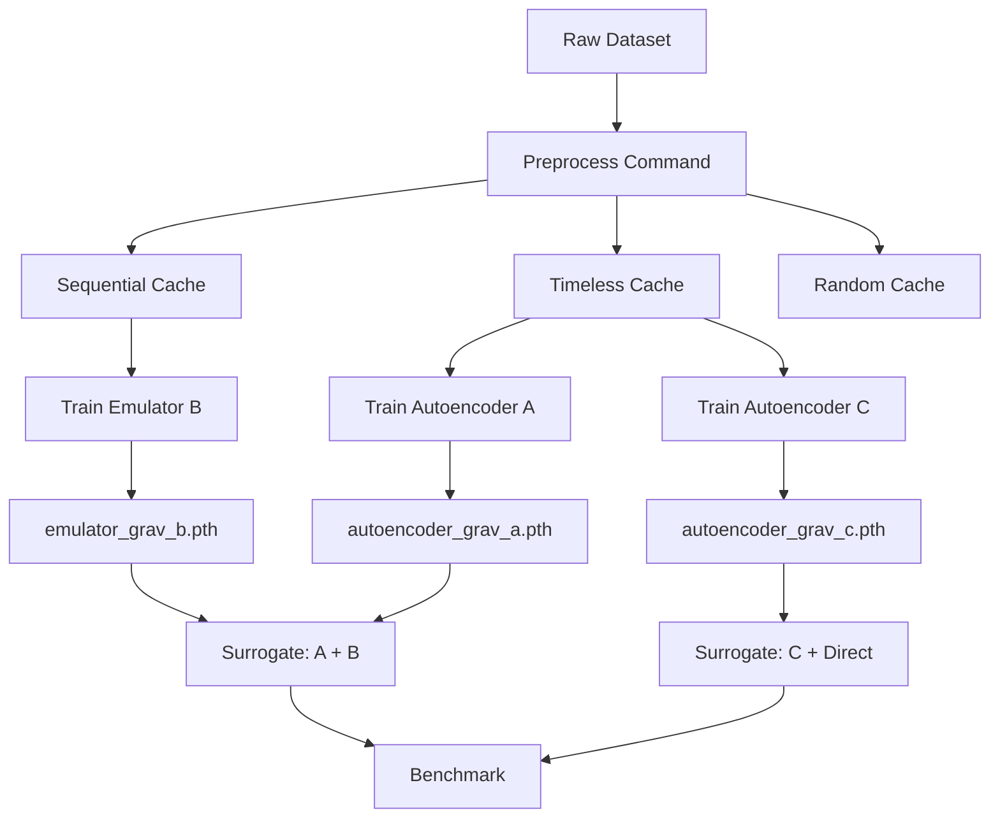

# Project Restructuring Plan v2: Component-Based Research Environment

## Overview

Transform AstroChemNet into a modular research environment with:
- **Separate preprocessing pipeline** - 3-5 methods shared across 20+ models
- **Component-based architecture** - Train autoencoders/emulators independently
- **Surrogate composition** - Combine trained components for inference
- **Dataset-driven configurations** - Different species counts, initial abundances
- **Clean imports** - Centralized PYTHONPATH setup

## Core Design Principles

1. **Preprocessing is independent** - Run once per dataset/method, reuse across models
2. **Components are self-contained** - Each config specifies its dataset + preprocessing dependency
3. **Surrogates compose components** - Reference trained weights for inference
4. **Folder-based organization** - Scales to 10+ datasets × 20+ models
5. **Config composition via Hydra** - No manual YAML loading, use defaults system
6. **All derived artifacts in outputs/** - Clear separation from immutable raw data

## Workflow



## Command Interface

```bash
# 1. Preprocess dataset (independent of models)
python preprocess.py grav sequential
python preprocess.py grav timeless
python preprocess.py turbulent random

# 2. Train components (uses Hydra composition)
python train.py component=autoencoder_grav_large
python train.py component=emulator_grav_sequential
python train.py component=autoencoder_grav_large component.lr=0.0005

# 3. Benchmark surrogates (loads trained components)
python benchmark.py ae_emulator_grav
python benchmark.py direct_emulator_grav
```

## New Project Structure

```
AstroChemicalNeuralNetworks/
├── train.py                           # Hydra entry point for training
├── preprocess.py                      # Argparse entry point for preprocessing
├── benchmark.py                       # Argparse entry point for benchmarking
├── astrochemnet.py                    # Centralized PYTHONPATH setup
├── src/                               # Core modules
│   ├── models/
│   │   ├── autoencoder.py
│   │   ├── emulator.py
│   │   └── direct_emulator.py        # Future: no autoencoder
│   ├── trainers/
│   │   ├── __init__.py               # Registry exports
│   │   ├── base_trainer.py
│   │   ├── autoencoder_trainer.py
│   │   └── emulator_trainer.py
│   ├── preprocessors/                 # Preprocessing methods
│   │   ├── __init__.py               # Registry exports
│   │   ├── base_preprocessor.py
│   │   ├── sequential.py             # Time-series aware
│   │   ├── timeless.py               # Shuffle all samples
│   │   └── random.py                 # Random splits
│   ├── surrogates/                    # Inference compositions
│   │   ├── __init__.py               # Registry exports
│   │   ├── base_surrogate.py
│   │   └── autoencoder_emulator.py
│   ├── data_loading.py
│   ├── data_processing.py
│   ├── loss.py
│   ├── inference.py
│   ├── analysis.py
│   └── utils.py
├── configs/
│   ├── train.yaml                     # Base training config
│   ├── datasets/                      # Dataset definitions
│   │   ├── grav.yaml
│   │   ├── turbulent.yaml
│   │   └── collapse.yaml
│   ├── preprocessing/                 # Preprocessing methods
│   │   ├── sequential.yaml
│   │   ├── timeless.yaml
│   │   └── random.yaml
│   ├── components/                    # Trainable models
│   │   ├── autoencoder_grav_large.yaml
│   │   ├── autoencoder_grav_small.yaml
│   │   ├── emulator_grav_sequential.yaml
│   │   └── direct_emulator_turbulent.yaml
│   └── surrogates/                    # Inference compositions
│       ├── ae_emulator_grav.yaml
│       └── direct_emulator_turbulent.yaml
├── data/                              # ONLY raw data
│   └── raw/
│       ├── gravitational_collapse.h5
│       └── turbulent_cloud.h5
├── outputs/                           # ALL derived artifacts
│   ├── preprocessed/                  # Cached by dataset/method
│   │   ├── grav/
│   │   │   ├── sequential/
│   │   │   │   ├── train.h5
│   │   │   │   └── val.h5
│   │   │   └── timeless/
│   │   │       ├── train.pt
│   │   │       └── val.pt
│   │   └── turbulent/
│   │       └── random/
│   ├── weights/                       # Trained component weights
│   │   ├── autoencoder_grav_large/
│   │   │   ├── weights.pth
│   │   │   ├── config.yaml            # Config snapshot
│   │   │   ├── metrics.json           # Per-epoch metrics
│   │   │   ├── summary.json           # Final summary
│   │   │   └── latents_minmax.npy
│   │   └── emulator_grav_sequential/
│   │       ├── weights.pth
│   │       ├── config.yaml
│   │       ├── metrics.json
│   │       └── summary.json
│   ├── utils/                         # Dataset-specific static files
│   │   ├── grav/
│   │   │   ├── species.txt
│   │   │   ├── stoichiometric_matrix.npy
│   │   │   └── initial_abundances.npy
│   │   └── turbulent/
│   │       ├── species.txt            # Different species count!
│   │       └── stoichiometric_matrix.npy
│   └── runs/                          # Hydra logs
├── scripts/                           # Analysis scripts
│   ├── compare_runs.py                # Compare training runs
│   └── notebooks/
└── research/                          # Experimental notebooks
```

## Configuration Examples

### Dataset Config (`configs/datasets/grav.yaml`)

```yaml
name: grav
raw_path: data/raw/gravitational_collapse.h5

# Species information
n_species: 333
species_file: outputs/utils/grav/species.txt
stoichiometric_matrix: outputs/utils/grav/stoichiometric_matrix.npy
initial_abundances: outputs/utils/grav/initial_abundances.npy

# Physical parameters
physical_parameters:
  names: [Density, Radfield, Av, gasTemp]
  n_params: 4
  ranges:
    Density: [68481, 1284211415]
    Radfield: [1.0e-4, 26]
    Av: [0.1, 6914]
    gasTemp: [13, 133]

# Data structure
metadata_columns: [Index, Model, Time]
columns_to_drop: [dustTemp, dstep, zeta, SURFACE, BULK]

# Preprocessing defaults
abundances_clipping:
  lower: 1.0e-20
  upper: 1.0

train_split: 0.75
seed: 42
```

### Preprocessing Config (`configs/preprocessing/sequential.yaml`)

```yaml
name: sequential
description: "Time-series aware preprocessing with sequence indexing"

# Output format
output_format: h5  # or pt for PyTorch tensors
compress: true

# Sequence-specific settings
preserve_time_order: true
sequence_length: null  # Full trajectories
create_indices: true   # For EmulatorSequenceDataset

# Scaling
apply_abundance_scaling: true
apply_physical_scaling: true
```

### Component Config (`configs/components/autoencoder_grav_large.yaml`)

```yaml
name: autoencoder_grav_large
type: autoencoder

# Dataset dependency (resolved via Hydra defaults)
dataset: grav
preprocessing_method: timeless

# Architecture (input_dim derived from dataset.n_species)
hidden_dims: [160, 80]
latent_dim: 14

# Hyperparameters
lr: 1.0e-3
lr_decay: 0.5
lr_decay_patience: 12
betas: [0.99, 0.999]
weight_decay: 1.0e-4
batch_size: 65536
epochs: 1000
stagnant_epoch_patience: 20
gradient_clipping: 2.0
dropout: 0.3
noise: 0.1

# Loss weights
power_weight: 20
conservation_weight: 100
```

### Component Config (`configs/components/emulator_grav_sequential.yaml`)

```yaml
name: emulator_grav_sequential
type: emulator

# Dataset dependency
dataset: grav
preprocessing_method: sequential

# Autoencoder dependency (weights auto-resolved)
autoencoder_component: autoencoder_grav_large

# Architecture (dims derived from autoencoder.latent_dim + dataset.n_params)
hidden_dims: [256, 256, 128]

# Hyperparameters
lr: 1.0e-3
batch_size: 16384
epochs: 500
gradient_clipping: 1.0
dropout: 0.3
```

### Surrogate Config (`configs/surrogates/ae_emulator_grav.yaml`)

```yaml
name: ae_emulator_grav
description: "Autoencoder + Emulator surrogate for gravitational collapse"

# Component references (weights auto-resolved from component name)
components:
  encoder: autoencoder_grav_large
  emulator: emulator_grav_sequential
  decoder: autoencoder_grav_large  # Same as encoder (tied weights)

# Inference settings
rollout_steps: 100
device: cuda
```

### Train Config (`configs/train.yaml`)

```yaml
defaults:
  - _self_
  - component: ???  # Required, must be specified via CLI
  - dataset@_global_: ${component.dataset}  # Auto-resolve from component
  - preprocessing@_global_: ${component.preprocessing_method}

# Hydra output directory settings
hydra:
  run:
    dir: outputs/runs/${now:%Y-%m-%d}/${now:%H-%M-%S}
  sweep:
    dir: outputs/multirun/${now:%Y-%m-%d}/${now:%H-%M-%S}
```

## Registry Implementation

### Explicit Registry Pattern

```python
# src/trainers/__init__.py
from trainers.autoencoder_trainer import AutoencoderTrainer
from trainers.emulator_trainer import EmulatorTrainer

TRAINER_REGISTRY = {
    "autoencoder": AutoencoderTrainer,
    "emulator": EmulatorTrainer,
}
```

```python
# src/preprocessors/__init__.py
from preprocessors.sequential import SequentialPreprocessor
from preprocessors.timeless import TimelessPreprocessor
from preprocessors.random import RandomPreprocessor

PREPROCESSOR_REGISTRY = {
    "sequential": SequentialPreprocessor,
    "timeless": TimelessPreprocessor,
    "random": RandomPreprocessor,
}
```

```python
# src/surrogates/__init__.py
from surrogates.autoencoder_emulator import AutoencoderEmulatorSurrogate

SURROGATE_REGISTRY = {
    "ae_emulator_grav": AutoencoderEmulatorSurrogate,
    "direct_emulator_turbulent": DirectEmulatorSurrogate,
}
```

## Centralized Path Setup

```python
# astrochemnet.py (at project root)
"""Import this to setup paths automatically."""
import sys
from pathlib import Path

ROOT = Path(__file__).parent.resolve()
if str(ROOT / "src") not in sys.path:
    sys.path.insert(0, str(ROOT / "src"))

# Re-export common modules for convenience
from trainers import TRAINER_REGISTRY
from preprocessors import PREPROCESSOR_REGISTRY
from surrogates import SURROGATE_REGISTRY
```

Usage in notebooks:
```python
# In any notebook or script
import sys
sys.path.insert(0, "..")  # or path to project root
import astrochemnet  # This sets up everything

# Now direct imports work
from models.autoencoder import Autoencoder
from trainers import TRAINER_REGISTRY
```

## Entry Points

### preprocess.py (Argparse - Simple)

```python
#!/usr/bin/env python
# preprocess.py
import sys
from pathlib import Path

ROOT = Path(__file__).parent.resolve()
sys.path.insert(0, str(ROOT / "src"))

import argparse
from omegaconf import OmegaConf
from preprocessors import PREPROCESSOR_REGISTRY


def main():
    parser = argparse.ArgumentParser(description="Preprocess dataset")
    parser.add_argument("dataset", help="Dataset name (e.g., grav)")
    parser.add_argument("method", help="Preprocessing method (e.g., sequential)")
    args = parser.parse_args()

    dataset_cfg = OmegaConf.load(ROOT / f"configs/datasets/{args.dataset}.yaml")
    method_cfg = OmegaConf.load(ROOT / f"configs/preprocessing/{args.method}.yaml")

    preprocessor = PREPROCESSOR_REGISTRY[args.method](dataset_cfg, method_cfg, ROOT)
    output_dir = ROOT / f"outputs/preprocessed/{args.dataset}/{args.method}"
    output_dir.mkdir(parents=True, exist_ok=True)

    preprocessor.run(output_dir)
    print(f"✓ Preprocessed {args.dataset}/{args.method} → {output_dir}")


if __name__ == "__main__":
    main()
```

### train.py (Hydra - Config Composition)

```python
#!/usr/bin/env python
# train.py
import sys
from pathlib import Path

ROOT = Path(__file__).parent.resolve()
sys.path.insert(0, str(ROOT / "src"))

import hydra
from omegaconf import DictConfig
from trainers import TRAINER_REGISTRY


@hydra.main(config_path="configs", config_name="train", version_base=None)
def main(cfg: DictConfig):
    # Verify preprocessing exists
    preprocess_dir = ROOT / f"outputs/preprocessed/{cfg.dataset.name}/{cfg.preprocessing.name}"
    if not preprocess_dir.exists():
        raise ValueError(
            f"Preprocessing not found: {preprocess_dir}\n"
            f"Run: python preprocess.py {cfg.dataset.name} {cfg.preprocessing.name}"
        )

    # Get trainer class and instantiate
    trainer_cls = TRAINER_REGISTRY[cfg.component.type]
    trainer = trainer_cls(cfg, ROOT)

    # Train
    trainer.train()

    print(f"✓ Trained {cfg.component.name}")
    print(f"  Weights: outputs/weights/{cfg.component.name}/")
    print(f"  Config:  outputs/weights/{cfg.component.name}/config.yaml")
    print(f"  Metrics: outputs/weights/{cfg.component.name}/metrics.json")


if __name__ == "__main__":
    main()
```

### benchmark.py (Argparse - Simple)

```python
#!/usr/bin/env python
# benchmark.py
import sys
from pathlib import Path

ROOT = Path(__file__).parent.resolve()
sys.path.insert(0, str(ROOT / "src"))

import argparse
from omegaconf import OmegaConf
from surrogates import SURROGATE_REGISTRY


def load_component_config(component_name: str, root: Path):
    """Load component config and its weights path."""
    config_path = root / f"configs/components/{component_name}.yaml"
    weights_path = root / f"outputs/weights/{component_name}/weights.pth"

    if not weights_path.exists():
        raise ValueError(f"Weights not found: {weights_path}")

    return OmegaConf.load(config_path), weights_path


def main():
    parser = argparse.ArgumentParser(description="Benchmark surrogate model")
    parser.add_argument("surrogate", help="Surrogate config name")
    args = parser.parse_args()

    surrogate_cfg = OmegaConf.load(ROOT / f"configs/surrogates/{args.surrogate}.yaml")

    # Load all component configs and weights
    components = {}
    for role, component_name in surrogate_cfg.components.items():
        cfg, weights = load_component_config(component_name, ROOT)
        components[role] = {"config": cfg, "weights": weights}

    # Instantiate and benchmark
    surrogate = SURROGATE_REGISTRY[surrogate_cfg.name](surrogate_cfg, components, ROOT)
    results = surrogate.benchmark()

    print(f"✓ Benchmark: {args.surrogate}")
    print(results)


if __name__ == "__main__":
    main()
```

## Training with JSON Logging (No MLflow)

### Base Trainer with JSON Metrics

```python
# src/trainers/base_trainer.py
import json
from pathlib import Path
from omegaconf import DictConfig, OmegaConf


class BaseTrainer:
    def __init__(self, cfg: DictConfig, root: Path):
        self.cfg = cfg
        self.root = root
        self.output_dir = root / f"outputs/weights/{cfg.component.name}"
        self.output_dir.mkdir(parents=True, exist_ok=True)

        # Training state
        self.metrics = []
        self.best_loss = float("inf")
        self.current_epoch = 0
        self.param_count = 0

    def train(self):
        # Save config snapshot
        OmegaConf.save(self.cfg, self.output_dir / "config.yaml")

        # Training loop
        for epoch in range(self.cfg.component.epochs):
            self.current_epoch = epoch
            train_loss = self.train_epoch()
            val_loss = self.validate_epoch()

            # Track best
            if val_loss < self.best_loss:
                self.best_loss = val_loss
                self.save_weights()

            # Log metrics
            self.metrics.append({
                "epoch": epoch,
                "train_loss": train_loss,
                "val_loss": val_loss,
                "best_val_loss": self.best_loss,
            })

            # Early stopping check
            if self.should_stop():
                break

        # Save final metrics
        with open(self.output_dir / "metrics.json", "w") as f:
            json.dump(self.metrics, f, indent=2)

        # Save summary
        summary = {
            "best_val_loss": self.best_loss,
            "final_epoch": self.current_epoch,
            "total_params": self.param_count,
            "dataset": self.cfg.dataset.name,
            "preprocessing": self.cfg.preprocessing.name,
            "component_type": self.cfg.component.type,
        }
        with open(self.output_dir / "summary.json", "w") as f:
            json.dump(summary, f, indent=2)

    def save_weights(self):
        """Save model weights."""
        raise NotImplementedError

    def train_epoch(self):
        """Train one epoch, return loss."""
        raise NotImplementedError

    def validate_epoch(self):
        """Validate, return loss."""
        raise NotImplementedError

    def should_stop(self):
        """Check early stopping criteria."""
        raise NotImplementedError
```

### Comparing Training Runs

```python
# scripts/compare_runs.py
import json
from pathlib import Path
import pandas as pd


def compare_runs(component_names: list[str]):
    """Compare multiple training runs."""
    root = Path(__file__).parent.parent
    rows = []

    for name in component_names:
        summary_path = root / f"outputs/weights/{name}/summary.json"
        if not summary_path.exists():
            print(f"Warning: {name} not found")
            continue

        with open(summary_path) as f:
            summary = json.load(f)
        summary["component"] = name
        rows.append(summary)

    df = pd.DataFrame(rows)
    print(df.sort_values("best_val_loss"))
    return df


def plot_learning_curves(component_names: list[str]):
    """Plot learning curves for multiple components."""
    import matplotlib.pyplot as plt

    root = Path(__file__).parent.parent
    fig, (ax1, ax2) = plt.subplots(1, 2, figsize=(12, 5))

    for name in component_names:
        metrics_path = root / f"outputs/weights/{name}/metrics.json"
        with open(metrics_path) as f:
            metrics = json.load(f)

        epochs = [m["epoch"] for m in metrics]
        train_loss = [m["train_loss"] for m in metrics]
        val_loss = [m["val_loss"] for m in metrics]

        ax1.plot(epochs, train_loss, label=name)
        ax2.plot(epochs, val_loss, label=name)

    ax1.set_title("Training Loss")
    ax1.set_xlabel("Epoch")
    ax1.legend()

    ax2.set_title("Validation Loss")
    ax2.set_xlabel("Epoch")
    ax2.legend()

    plt.tight_layout()
    plt.savefig(root / "outputs/comparison.png", dpi=150)
    plt.show()


if __name__ == "__main__":
    import sys
    compare_runs(sys.argv[1:])
```

Usage:
```bash
python scripts/compare_runs.py autoencoder_grav_large autoencoder_grav_small
```

## Usage Examples

### Standard Training

```bash
# Preprocessing (simple argparse)
python preprocess.py grav sequential
python preprocess.py grav timeless

# Training (Hydra with config composition)
python train.py component=autoencoder_grav_large

# Override hyperparameters
python train.py component=autoencoder_grav_large component.lr=0.0005

# Hyperparameter sweep
python train.py -m component=autoencoder_grav_large component.lr=0.001,0.0005,0.0001

# Benchmarking (simple argparse)
python benchmark.py ae_emulator_grav
```

### Understanding Config Composition

When you run:
```bash
python train.py component=autoencoder_grav_large
```

Hydra composes the config as:
1. Loads `configs/train.yaml`
2. Loads `configs/components/autoencoder_grav_large.yaml` → `cfg.component`
3. Resolves `cfg.component.dataset = "grav"` → Loads `configs/datasets/grav.yaml` → `cfg.dataset`
4. Resolves `cfg.component.preprocessing_method = "timeless"` → Loads `configs/preprocessing/timeless.yaml` → `cfg.preprocessing`

Result: Single `cfg` object with all composed configs accessible:
- `cfg.component.lr` - Learning rate from component config
- `cfg.dataset.n_species` - Species count from dataset config
- `cfg.preprocessing.output_format` - Format from preprocessing config

## Implementation Phases

### Phase 1: Restructure Directory Layout
1. Create `data/raw/` and move raw HDF5 files
2. Create `outputs/preprocessed/`, `outputs/weights/`, `outputs/utils/`
3. Create entry point scripts at project root
4. Create `astrochemnet.py` for centralized path setup

### Phase 2: Implement Registry System
1. Create `src/trainers/__init__.py` with registry
2. Create `src/preprocessors/__init__.py` with registry
3. Create `src/surrogates/__init__.py` with registry
4. Test imports from entry points

### Phase 3: Update Configs for Hydra Composition
1. Create `configs/train.yaml` with defaults system
2. Update dataset configs with all required fields
3. Create preprocessing method configs
4. Create component configs (remove hardcoded paths)
5. Test: `python train.py component=autoencoder_grav_large`

### Phase 4: Refactor Trainers
1. Create `BaseTrainer` with JSON logging
2. Implement `AutoencoderTrainer` and `EmulatorTrainer`
3. Integrate config composition (use `cfg.dataset.n_species`)
4. Test full training pipeline

### Phase 5: Create Surrogate System
1. Implement `BaseSurrogate` with weight loading
2. Implement `AutoencoderEmulatorSurrogate`
3. Test benchmarking with automatic path resolution
4. Verify component configs are loaded correctly

### Phase 6: Clean Up
1. Remove old `src/cli/` directory
2. Clean `pyproject.toml` (keep only Ruff config)
3. Update memory bank documentation
4. Add comparison scripts

## Example Workflow: Adding a New Dataset

```bash
# 1. Place raw data
cp new_simulation.h5 data/raw/

# 2. Create dataset config
vim configs/datasets/turbulent.yaml
# Define: raw_path, n_species=250, physical_parameters, etc.

# 3. Preprocess with desired methods
python preprocess.py turbulent sequential
python preprocess.py turbulent timeless

# 4. Create component configs that use this dataset
vim configs/components/autoencoder_turbulent_small.yaml
# Reference: dataset: turbulent, preprocessing_method: timeless

# 5. Train
python train.py component=autoencoder_turbulent_small

# 6. Compare with other models
python scripts/compare_runs.py autoencoder_turbulent_small autoencoder_grav_large
```

## Example Workflow: New Model Architecture

```bash
# 1. Create new model class
vim src/models/vae.py
# Implement: VAE architecture

# 2. Create trainer
vim src/trainers/vae_trainer.py
# Implement: VAETrainer class

# 3. Register trainer
vim src/trainers/__init__.py
# Add: TRAINER_REGISTRY["vae"] = VAETrainer

# 4. Create component config
vim configs/components/vae_grav_standard.yaml
# type: vae, dataset: grav, preprocessing_method: timeless

# 5. Train
python train.py component=vae_grav_standard

# 6. Integrate into surrogate (maybe skip autoencoder entirely)
vim configs/surrogates/vae_emulator_grav.yaml
```

## Benefits Over Original Plan

1. **Proper Hydra composition** - No manual `OmegaConf.load()`, use defaults system
2. **Derived paths** - Weights path auto-resolved from component name, not hardcoded
3. **Consistent directory structure** - All derived artifacts in `outputs/`, raw data in `data/raw/`
4. **Explicit registries** - Simple dict-based pattern, easy to understand and extend
5. **JSON + Hydra logging** - No MLflow overhead, simple file-based metrics
6. **Centralized path setup** - Single `astrochemnet.py` module handles PYTHONPATH
7. **No package installation** - Pure research environment
8. **Self-documenting** - Config files show exact composition
9. **Reproducible** - Config snapshots saved with every training run

## Migration from Current Structure

1. **Raw data**: `data/*.h5` → `data/raw/*.h5`
2. **Preprocessed**: `data/*.pt` → `outputs/preprocessed/grav/timeless/*.pt`
3. **Weights**: `weights/autoencoder.pth` → `outputs/weights/autoencoder_grav_large/weights.pth`
4. **Utils**: `utils/species.txt` → `outputs/utils/grav/species.txt`
5. **Configs**: `configs/models/` → `configs/components/`
6. **CLI**: `src/cli/train_autoencoder.py` → `train.py` (at project root)
