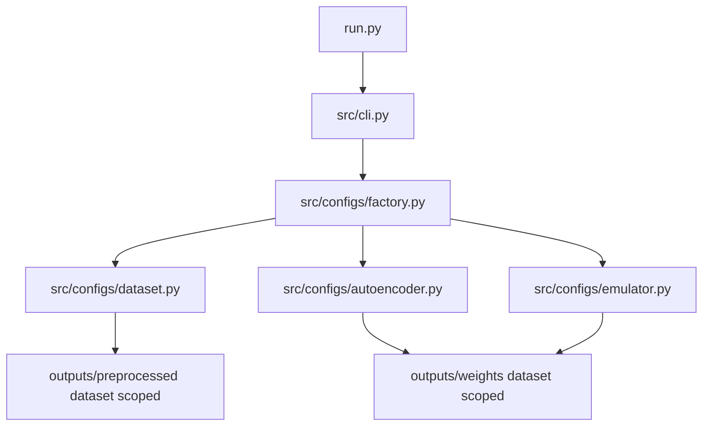

# Plan: Replace GeneralConfig with DatasetConfig + dataset-specific AE/EM configs

## Goals

- Replace [`src/configs/general.py`](src/configs/general.py) [`GeneralConfig`](src/configs/general.py:13) with a dataset-focused config named `DatasetConfig`, implemented in a renamed module [`src/configs/datasets.py`](src/configs/datasets.py:1).
- Allow **dataset-specific** autoencoder/emulator hyperparameters and **dataset-scoped** weight paths (for example `outputs/weights/<dataset>/autoencoder.pth`).
- Keep changes **minimal** and **clean** by:
  - preserving existing field names where possible
  - using a small dataset registry (two initialized dataset specs)
  - avoiding new abstraction layers unless they remove duplication

## Current state (relevant)

- [`src/configs/general.py`](src/configs/general.py) mixes runtime + dataset artifacts:
  - dataset selection via `dataset_name`
  - paths into `outputs/preprocessed/<dataset>`
  - computed fields like `species`, `phys`, counts, etc.
- [`src/configs/autoencoder.py`](src/configs/autoencoder.py) and [`src/configs/emulator.py`](src/configs/emulator.py) define model hyperparameters with static defaults and compute derived dims/paths.
- Weight paths are currently **not dataset-scoped**:
  - AE uses `outputs/weights/autoencoder.pth`
  - EM uses `outputs/weights/mlp.pth`

## Target design (aligned with your preference)

### 1) Rename module + introduce DatasetConfig

Rename [`src/configs/general.py`](src/configs/general.py) to [`src/configs/datasets.py`](src/configs/datasets.py), and inside it define `DatasetConfig` (a near copy of [`GeneralConfig`](src/configs/general.py:13)):

- `dataset_name: str` (required)
- keep these existing concepts/fields to minimize churn:
  - `project_root`, `device`
  - `abundances_lower_clipping`, `abundances_upper_clipping`
  - `metadata`
  - `preprocessing_dir`, `dataset_path`, `columns_mapping_path`
  - `physical_parameter_ranges`, `stoichiometric_matrix`, `species`, `phys`
  - `num_metadata`, `num_phys`, `num_species`
- add a couple of **dataset-scoped output dirs**:
  - `weights_dir = <project_root>/outputs/weights/<dataset_name>`
  - optional cache dirs used by preprocessing (see emulator section)

This is mostly a rename + small path additions.

To keep churn minimal, optionally keep a short-lived alias in [`src/configs/datasets.py`](src/configs/datasets.py:1):

- `GeneralConfig = DatasetConfig` (deprecated) so old imports keep working during migration.

### 2) Two initialized dataset specs (runtime selection)

In the same renamed module [`src/configs/datasets.py`](src/configs/datasets.py:1), define a small “spec” dataclass that is intentionally *not* the runtime config itself, but a way to initialize configs per dataset:

- `AVAILABLE_DATASETS = [uclchem_grav, carbox_grav, ...]`
- two initialized instances below (what you described):
  - one for `uclchem_grav`
  - one for `carbox_grav`

Each spec contains:

- `dataset_name`
- `ae_kwargs: dict[str, Any]` for [`AEConfig`](src/configs/autoencoder.py:10) init-time overrides
- `em_kwargs: dict[str, Any]` for [`EMConfig`](src/configs/emulator.py:11) init-time overrides

Implementation should stay simple and explicit: either

- `DATASET_SPECS: dict[str, DatasetSpec]`

or

- two named constants and a dict mapping.

Example shape (conceptual):

- `AE_PRESETS[dataset_name] = {latent_dim: ..., hidden_dims: ..., batch_size: ...}`
- `EM_PRESETS[dataset_name] = {hidden_dim: ..., window_size: ..., batch_size: ...}`

Important: this satisfies your preference that values are chosen **at runtime** based on dataset selection, without relying on silent global defaults.

### 3) Minimal builder functions (no extra factory module)

In [`src/configs/datasets.py`](src/configs/datasets.py:1), add small builder functions:

- `build_dataset_config(dataset_name) -> DatasetConfig`
- `build_ae_config(dataset_config) -> AEConfig`
- `build_em_config(dataset_config, ae_config) -> EMConfig`

Responsibilities:

- look up `DatasetSpec` by `dataset_name`
- instantiate configs with `**ae_kwargs` and `**em_kwargs`
- ensure AE + EM are derived from the same dataset config

### 4) Update AEConfig/EMConfig to be dataset-driven

Modify [`src/configs/autoencoder.py`](src/configs/autoencoder.py):

- replace dependency on [`GeneralConfig`](src/configs/general.py) with `DatasetConfig` from [`src/configs/datasets.py`](src/configs/datasets.py:1)
- require `dataset_config` explicitly (avoid default_factory that silently creates `uclchem_grav`)
- compute derived fields from `dataset_config` as today
- update paths to be dataset-scoped:
  - `pretrained_model_path = <weights_dir>/autoencoder.pth`
  - `save_model_path = <weights_dir>/autoencoder.pth`
  - keep `latents_minmax_path` under `<preprocessing_dir>/latents_minmax.npy` (already dataset-scoped)

Modify [`src/configs/emulator.py`](src/configs/emulator.py):

- require `dataset_config` and `ae_config`
- dataset-scoped weights:
  - `pretrained_model_path = <weights_dir>/mlp.pth`
  - `save_model_path = <weights_dir>/mlp.pth`

### 5) Make emulator-preprocessing artifacts dataset-scoped

Currently HDF5 save/load uses a shared path in [`src/data_loading.py`](src/data_loading.py) (`data/{category}.h5`) which will collide across datasets.

Change strategy (minimal, high value):

- store emulator sequence HDF5 under the dataset preprocessing directory, e.g.
  - `<preprocessing_dir>/emulator/training_seq.h5`
  - `<preprocessing_dir>/emulator/validation_seq.h5`

This keeps all dataset artifacts together and naturally prevents collisions.

This will touch:

- [`src/data_loading.py`](src/data_loading.py) save/load functions
- [`src/preprocessing/emulator_preprocessing.py`](src/preprocessing/emulator_preprocessing.py)
- [`src/training/train_emulator.py`](src/training/train_emulator.py)

### 6) Wire everything through CLI via dataset builders

Update [`src/cli.py`](src/cli.py) so all entrypoints build configs through the builder functions in [`src/configs/datasets.py`](src/configs/datasets.py:1).

- `train autoencoder`:
  - `dataset_config = build_dataset_config(dataset)`
  - `ae_config = build_ae_config(dataset_config)`
- `train emulator`:
  - `dataset_config = build_dataset_config(dataset)`
  - `ae_config = build_ae_config(dataset_config)`
  - `em_config = build_em_config(dataset_config, ae_config)`

For `preprocess emulator`, consider making it dataset-aware (so it can preprocess emulator sequences for `carbox_grav` too):

- update [`run.py`](run.py) to allow `python run.py preprocess emulator --dataset <name>`
- in [`src/cli.py`](src/cli.py) build configs for that dataset and call preprocessing

## Mermaid overview

## Compatibility + migration strategy

To minimize churn while still meeting the goal of switching to `DatasetConfig`:

1. Implement `DatasetConfig` and update the codebase imports to use it.
2. Keep [`src/configs/general.py`](src/configs/general.py) as a temporary shim:
   - either re-export `DatasetConfig` as `GeneralConfig`
   - or keep `GeneralConfig` but mark deprecated and delegate to `DatasetConfig`
3. Once downstream code is updated, optionally delete the shim later.

## Key cleanups worth bundling (small, prevents bugs)

- Fix places that accidentally use class attributes instead of instance config:
  - [`src/training/train_autoencoder.py`](src/training/train_autoencoder.py) uses `AEConfig.batch_size` and `AEConfig.latents_minmax_path` inside `save_latents_minmax`, which should use the `ae_config` instance so per-dataset settings work.

## Acceptance criteria

- Running with `--dataset carbox_grav` selects:
  - preprocessing artifacts in `outputs/preprocessed/carbox_grav/`
  - weights in `outputs/weights/carbox_grav/`
  - AE/EM hyperparameters from the `carbox_grav` dataset spec in [`src/configs/datasets.py`](src/configs/datasets.py:1)
- Switching datasets does not overwrite:
  - model weights
  - emulator sequence HDF5 artifacts
