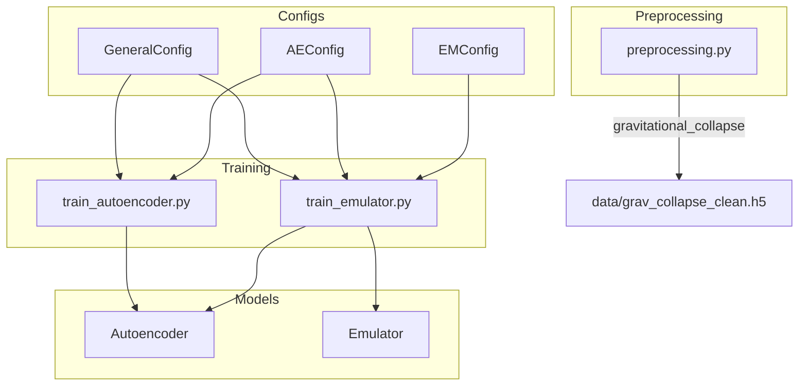
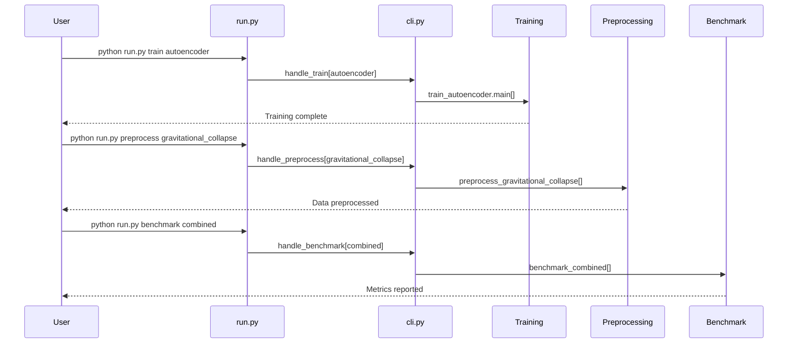

# Plan: CLI Entrypoint for `run.py`

## Overview

Create a unified CLI entrypoint in [`run.py`](run.py) that enables:
1. Training different neural network components (autoencoder, emulator)
2. Running preprocessing for different datasets
3. Benchmarking combined model performance

## Current Architecture



## Proposed CLI Structure

```bash
# Training commands
python run.py train autoencoder
python run.py train emulator

# Preprocessing commands
python run.py preprocess gravitational_collapse

# Benchmarking commands
python run.py benchmark autoencoder
python run.py benchmark emulator
python run.py benchmark combined
```

## Implementation Plan

### 1. Create CLI Module Structure

Create a new [`src/cli.py`](src/cli.py) module to handle CLI parsing and command routing:

```
src/
├── cli.py              # NEW: CLI argument parsing and command routing
├── benchmark.py        # NEW: Benchmarking functions
└── ...existing files
```

### 2. Refactor Preprocessing

The current [`src/preprocessing/preprocessing.py`](src/preprocessing/preprocessing.py:1) is a standalone script. Refactor to support multiple datasets:

```python
# src/preprocessing/preprocessing.py
def preprocess_gravitational_collapse(input_path: str, output_path: str) -> None:
    """Preprocess gravitational collapse dataset."""
    ...

PREPROCESSORS = {
    "gravitational_collapse": preprocess_gravitational_collapse,
    # Future datasets can be added here
}

def get_preprocessor(dataset_name: str):
    """Get preprocessor function for dataset."""
    return PREPROCESSORS.get(dataset_name)
```

### 3. Create Benchmarking Module

Create [`src/benchmark.py`](src/benchmark.py) for model evaluation:

```python
# src/benchmark.py
def benchmark_autoencoder(
    autoencoder: Autoencoder,
    test_data: torch.Tensor,
    processing_functions: Processing,
) -> dict:
    """Benchmark autoencoder reconstruction accuracy."""
    ...

def benchmark_emulator(
    emulator: Emulator,
    autoencoder: Autoencoder,
    test_data: torch.Tensor,
    processing_functions: Processing,
) -> dict:
    """Benchmark emulator prediction accuracy."""
    ...

def benchmark_combined(
    emulator: Emulator,
    autoencoder: Autoencoder,
    test_data: torch.Tensor,
    processing_functions: Processing,
) -> dict:
    """Benchmark full pipeline: emulator + autoencoder decode."""
    ...
```

### 4. Update `run.py` Entry Point

```python
# run.py
"""Main entry point for training, preprocessing, and benchmarking."""

import argparse
import sys

from src.cli import handle_train, handle_preprocess, handle_benchmark


def main():
    parser = argparse.ArgumentParser(
        description="ACNN: Autoencoder and Emulator Training CLI"
    )
    subparsers = parser.add_subparsers(dest="command", help="Available commands")

    # Train subcommand
    train_parser = subparsers.add_parser("train", help="Train models")
    train_parser.add_argument(
        "model",
        choices=["autoencoder", "emulator"],
        help="Model to train"
    )

    # Preprocess subcommand
    preprocess_parser = subparsers.add_parser("preprocess", help="Run preprocessing")
    preprocess_parser.add_argument(
        "dataset",
        choices=["gravitational_collapse"],
        help="Dataset to preprocess"
    )

    # Benchmark subcommand
    benchmark_parser = subparsers.add_parser("benchmark", help="Benchmark models")
    benchmark_parser.add_argument(
        "model",
        choices=["autoencoder", "emulator", "combined"],
        help="Model to benchmark"
    )

    args = parser.parse_args()

    if args.command == "train":
        handle_train(args.model)
    elif args.command == "preprocess":
        handle_preprocess(args.dataset)
    elif args.command == "benchmark":
        handle_benchmark(args.model)
    else:
        parser.print_help()
        sys.exit(1)


if __name__ == "__main__":
    main()
```

### 5. CLI Handler Implementation

Create [`src/cli.py`](src/cli.py):

```python
# src/cli.py
"""CLI command handlers."""

from configs.autoencoder import AEConfig
from configs.emulator import EMConfig
from configs.general import GeneralConfig

from .models.autoencoder import Autoencoder
from .models.emulator import Emulator
from .training.train_autoencoder import main as train_autoencoder
from .training.train_emulator import main as train_emulator
from .preprocessing.preprocessing import get_preprocessor
from .benchmark import benchmark_autoencoder, benchmark_emulator, benchmark_combined


def handle_train(model: str) -> None:
    """Handle train command."""
    general_config = GeneralConfig()

    if model == "autoencoder":
        ae_config = AEConfig()
        print(f"Training Autoencoder on {general_config.device}")
        train_autoencoder(Autoencoder, general_config, ae_config)

    elif model == "emulator":
        print(f"Training Emulator on {general_config.device}")
        train_emulator()


def handle_preprocess(dataset: str) -> None:
    """Handle preprocess command."""
    preprocessor = get_preprocessor(dataset)
    if preprocessor:
        print(f"Preprocessing dataset: {dataset}")
        preprocessor()
    else:
        print(f"Unknown dataset: {dataset}")


def handle_benchmark(model: str) -> None:
    """Handle benchmark command."""
    general_config = GeneralConfig()
    ae_config = AEConfig()

    if model == "autoencoder":
        benchmark_autoencoder(general_config, ae_config)
    elif model == "emulator":
        em_config = EMConfig()
        benchmark_emulator(general_config, ae_config, em_config)
    elif model == "combined":
        em_config = EMConfig()
        benchmark_combined(general_config, ae_config, em_config)
```

## File Changes Summary

| File | Action | Description |
|------|--------|-------------|
| [`run.py`](run.py) | Modify | Add CLI argument parsing and command routing |
| [`src/cli.py`](src/cli.py) | Create | CLI command handlers |
| [`src/benchmark.py`](src/benchmark.py) | Create | Benchmarking functions for all models |
| [`src/preprocessing/preprocessing.py`](src/preprocessing/preprocessing.py) | Modify | Refactor to support multiple datasets |

## Execution Flow



## Next Steps

1. **Implement `src/cli.py`** - Create the CLI handler module
2. **Implement `src/benchmark.py`** - Create benchmarking functions
3. **Refactor `src/preprocessing/preprocessing.py`** - Add preprocessor registry
4. **Update `run.py`** - Add argument parsing and command routing
5. **Test CLI commands** - Verify all commands work correctly

## Notes

- Configuration is handled through existing config dataclasses ([`GeneralConfig`](src/configs/general.py:11), [`AEConfig`](src/configs/autoencoder.py:10), [`EMConfig`](src/configs/emulator.py:11))
- No CLI parameter overrides needed - all hyperparameters configured via config files
- Benchmarking module will be extensible for future metrics
- Preprocessing architecture supports adding new datasets via the `PREPROCESSORS` registry
